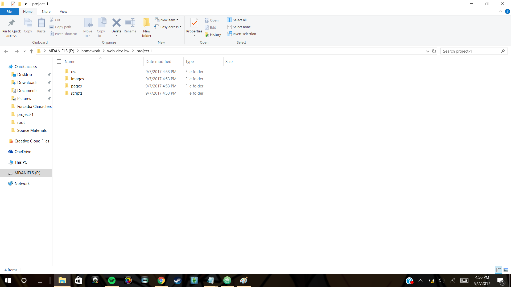

# My First README.md

## Misty Daniels
...

`The assignment was a little confusing to be honest, but I did learn quite a bit! I've coded in C# before, but Markdown is not something Im used to **whatsoever**.`

Things that I've learned

1. How to organize my files
2. How to name files
  * Dont use funky characters
  * Spaces
  * Or begin file names with numbers
3. Also did you know cables *run through the oceans*?!

[Heres a helpful link reminder!](https://github.com/adam-p/markdown-here/wiki/Markdown-Cheatsheet#videos)

