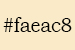
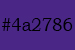
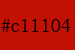
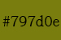
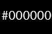
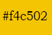
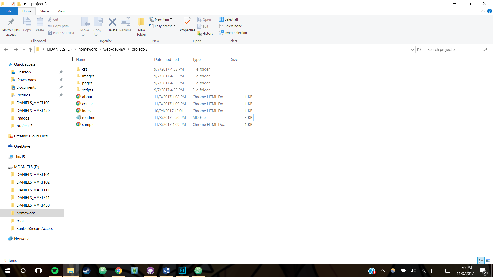

# My Third Readme

## Misty Daniels

***

The second font, Rozha seems to be working well. I can actually see a good
difference in them.

***
I had a little trouble with linking the fonts. I decided to use a PT Sans style
that I found on google fonts. I cant tell if its my eyes or if its just not working.
I'll keep messing with it.
Taking the color palette directly from the book worked out really well! The colors
work super great together and it gives a good feel for the style.
HERES A BIT OF GOOD ADVICE FOR PEOPLE THOUGH!
If you experience frequent migraines like I do and use programs like f.lux or something
similar that removes a bit of blue light and lowers the brightness of your screen..
do yourself a favor and turn it off when you're sampling colors! It makes so much
difference and I felt silly for forgetting it was on. Also f.lux is an awesome
program that you guys should try if you're staring at a screen often.. which I mean..
you are.
ONWARD.
I need to add a second font, I'm not sure what would work well but I do have a
backup downloaded that I can try.
***

***

I've selected a color palette based on the **book**. In photoshop I lifted colors
directly from the *original* cover and from the movie poster.

* 
* 
* 
* 
* 
* 

***

After reading through this weeks CSS lesson, I'm starting to formulate some
ideas for the coming project.
I want to make a 90's style page, maybe not as ugly, but with the eye
burning color scheme. Get a little nostalgic with it.
I think I'll base its content off of one of my favorite books, John Dies
at the End. Hopefully it wont be too graphic.
The more I think about it, I do want this page to have some sharp contrast, or
something very bold, I believe something like that would flow really well with
the book series.
I'm going to try not to go full comic sans neon pink on this page, despite
how hilarious and fun that would be. But we'll see.
Fortunately I shouldn't have to worry too much about images since the book
was recently been turned into a movie. Though I will also either take a
picture of my copy of the book, or find images of it online.
Maybe I can find some fanart that I'm able to use for this site?
***
Color ideas: Black, navy, deep purple, neon red, neon orange, neon purple/blue.
***
Possible quotes:
1. `Scientists talk about dark matter, the invisible, mysterious substance
that occupies the space between stars. Dark matter makes up 99.99 percent
of the universe, and they dont know what it is. Well I do. Its apathy.
Thats the truth of it; pile together everything we know and care about in the
universe and it will still be nothing more than a tiny speck in the middle
of a vast black ocean of Who Gives a Fuck`

1. `From day one it was like society was this violent, complicated dance and
everybody had taken lessons but me. Knocked to the floor again, climbing to my
feet each time, bloody and humiliated. Always met with disapproving faces,
waiting for me to leave so I'd stop fucking up the party.
The wanted to push me outside, where the freaks huddled in the cold. Out there
 with the misfits, the broken, the glazed-eye types who can only watch as the
  normals enjoy their shiny new cars and careers and marriages and vacations
  with the kids. The freaks spend their lives shambling around, wondering how
  they got left out, mumbling about conspiracy theories and bigfoot sightings.
  Their encounters with the world are marked by awkward conversations and
  stifled laughter, hidden smirks and rolled eyes. And worst of all, pity.`

Im not sure yet if I should use the short biography on his amazon as a cited
source, especially since David Wong is a psuedonym for his real name,
Jason Pargin, or if I'll use his page [John Dies at the End](http://www.johndiesattheend.com).
I'll flesh things out more as I go.

